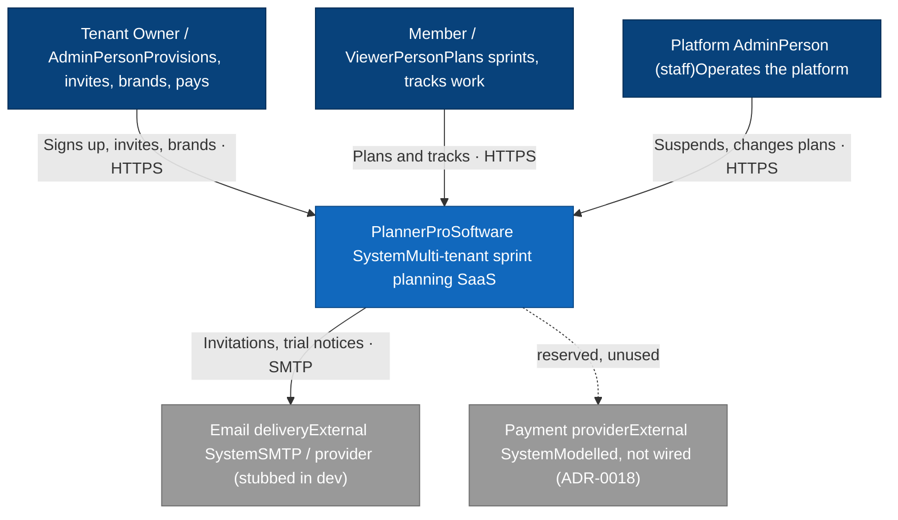
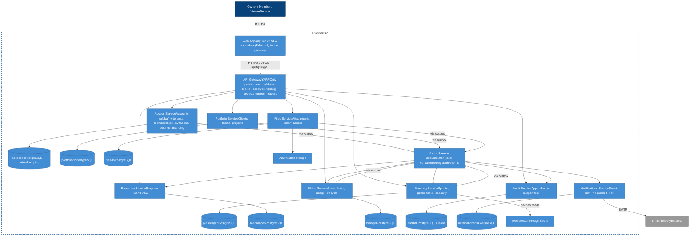
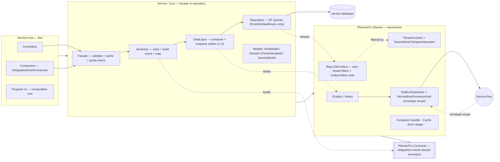
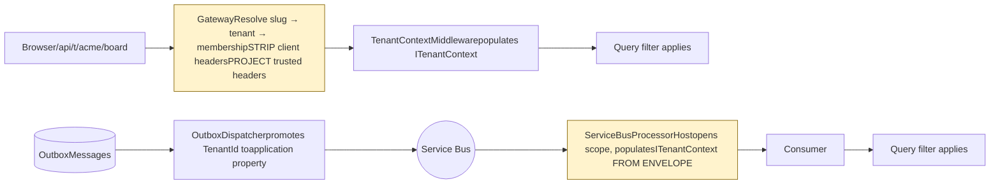
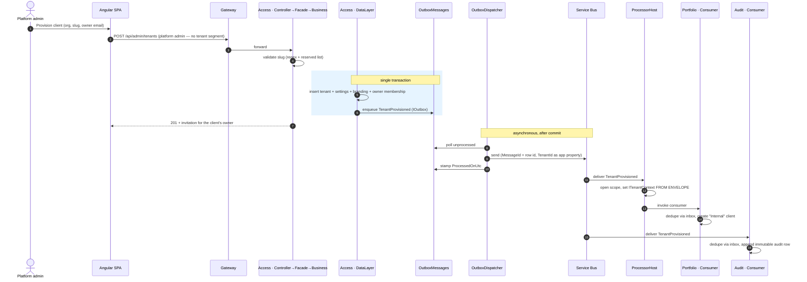
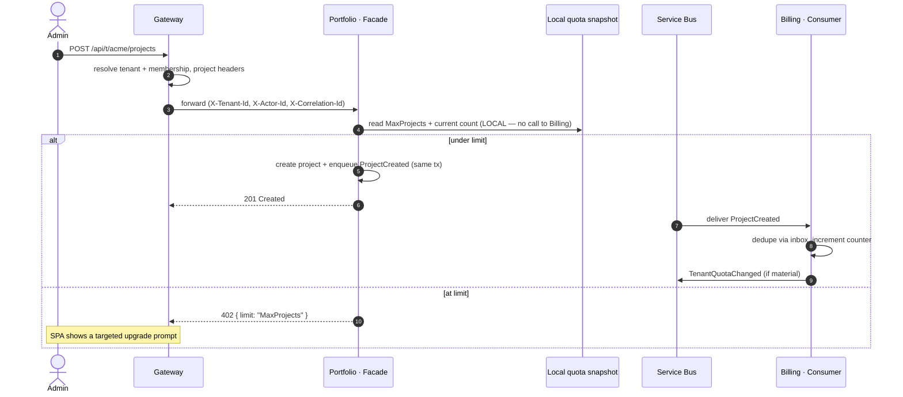

# PlannerPro — High-Level Design (HLD)

*Living document. Describes the **target** architecture the SCRUB prompt library builds, not the current state of `src/` (which does not exist yet — see [Build Plan & Risks](./build-plan-and-risks.md)).*

---

## 1. Purpose & context

PlannerPro is a **multi-tenant, white-label SaaS** for planning and tracking two-week sprints across parallel software projects. A tenant is a customer organization; clients are who *they* serve; projects hang off a client. Each sprint gives every project one goal, a status, and tasks carrying Fibonacci effort points, so an overloaded sprint is visible before it is lived through.

### 1.1 Goals

- A genuinely useful sprint-planning product for agencies and consultancies running several client engagements at once.
- A reference implementation of **tenant isolation in a database-per-service system** — the harder version of the multi-tenancy problem, and the one with the least good material written about it.
- A demonstration that an eight-service system can be built agentically without drifting, given a constitution, path-scoped rules, skills, and read-only review agents.

### 1.2 Non-goals (for now)

Custom domains and per-domain TLS · SSO/SAML/OIDC · live Stripe checkout and webhooks · per-tenant data residency · a public API with tenant API keys · third-party integrations (Slack, Jira) · a mobile app · real-time collaboration.

**Also out of scope by delivery model:** self-serve signup. PlannerPro is a tool Architect4Hire's
clients log into as part of an engagement. Tenants are provisioned by a platform admin; there is no
public `/api/signup`, no anonymous trial, and no checkout. Plans and limits still exist and still
constrain a tenant — they are just enforced against an invoiced relationship rather than a card.

### 1.3 Stakeholders & primary use cases

| Actor | Primary use |
| --- | --- |
| **Owner** | Provisions the tenant, invites people, changes plan, owns billing and branding |
| **Admin** | Manages clients, teams, projects, members, settings, branding |
| **Member** | Sets sprint goals, manages tasks, records capacity |
| **Viewer** | Reads board, roadmap and timeline; changes nothing |
| **Platform admin** (staff) | Lists tenants and usage, suspends and reactivates, changes plans |
| **Support** (human or agent) | Reconstructs what happened to a request or entity from the audit trail |

---

## 2. Architecture drivers & quality attributes

| Driver | Why it shapes the design | Where it lands |
| --- | --- | --- |
| **Tenant isolation** | A missed filter is a breach, not a bug | ADR-0008, ADR-0009, ADR-0011 — five layers of defense |
| **Independent evolvability** | Billing, files, and planning change at different rates | ADR-0001 — eight services, database per service |
| **Write-path availability** | Creating a project must not depend on Billing | ADR-0002, ADR-0017 — events and replicated quotas |
| **Reconstructability** | Support must answer "what happened" months later | ADR-0015, ADR-0016 — correlation/causation and the audit trail |
| **Same-origin auth** | A proven cookie + antiforgery model is worth preserving | ADR-0007, ADR-0021 — path-based tenancy |
| **Runnable locally** | An eight-service showcase nobody can start is not a showcase | ADR-0012 — Aspire, emulators, zero cloud spend |
| **Agent-buildable** | Eight services built loosely fail eight times over | `CLAUDE.md`, `.claude/rules/`, the prompt library |

---

## 3. System context (C4 — Level 1)

---

## 4. Container view (C4 — Level 2)

The gateway is the only public door and the only place tenancy is resolved. Every service owns its own database. Services communicate only over the bus.

### 4.0 The public front door

Everything the browser touches sits on **one hostname**, in three non-overlapping namespaces:

| Path | Serves | Owned by |
| --- | --- | --- |
| `/`, `/privacy`, `/terms` | static landing content | static files |
| `/app`, `/app/login`, `/app/tenants`, `/app/t/{slug}/…` | the Angular SPA | SPA shell |
| `/api/**` | everything else | gateway |

Route precedence is ordered and `/api` wins: **`/api/**` → `/app/**` → static → 404.** The SPA
fallback is scoped to `/app/**` only; an over-broad fallback that shadows `/api` is the failure mode
here, and it presents as the gateway being down.

Single origin throughout is what preserves ADR-0007's `SameSite=Strict` cookie plus antiforgery with
no CORS. `/app` is a resolver, not a redirect — it boots the shell, checks the session, then routes to
login, the tenant switcher, or the single tenant's board. Never a 301: browsers cache permanent
redirects, and a user who joins a second client or is offboarded gets pinned to a tenant they cannot
reach.

The `/app` namespace is an amendment to ADR-0007's documented route shape, recorded by Prompt 11.

### 4.1 The eight bounded contexts

| Service | Owns | Publishes | Consumes |
| --- | --- | --- | --- |
| **Access** | Accounts (**global**), tenants, settings, branding, memberships, invitations | `TenantProvisioned`, `TenantSettingsChanged`, `TenantBrandingChanged`, `MemberInvited`, `InvitationAccepted`, `MembershipChanged` | `TenantStatusChanged` |
| **Portfolio** | Clients, teams, team members, projects | `ClientCreated`, `ClientArchived`, `TeamChanged`, `ProjectCreated`, `ProjectArchived` | `TenantProvisioned`, `TenantQuotaChanged` |
| **Planning** | Sprints, sprint goals, tasks, capacity | `SprintGoalSet`, `TaskChanged`, `CapacitySet` | `ProjectCreated`, `ProjectArchived`, `TenantSettingsChanged` |
| **Roadmap** | Roadmap goals (program view) | `RoadmapGoalScheduled` | `ProjectCreated`, `ProjectArchived` |
| **Files** | Attachments, tenant assets | `AttachmentUploaded`, `AttachmentDeleted` (with byte size) | `TenantQuotaChanged` |
| **Billing** | Plans, usage counters, subscription lifecycle | `TenantQuotaChanged`, `TenantStatusChanged`, `TrialExpiring` | the countable events |
| **Audit** | Append-only support trail | *(nothing)* | **everything** |
| **Notifications** | Delivery log | *(nothing)* | `MemberInvited`, `TrialExpiring`, and others |

**Access is the one database with mixed scoping** (ADR-0010): Identity tables are global and deliberately unfiltered; everything else in `accessdb` is tenant-scoped like any other service. This is commented in code and is the most likely place someone "fixes" an intentional omission.

---

## 5. Logical architecture — per-service layering

Every service is a **thin host** plus a **`.Core`** library (ADR-0005).

**Layer responsibilities.** Controller/consumer binds and delegates. Facade validates, caches, and checks the local quota snapshot. Business maps, applies rules, and **builds** the integration event with its full envelope. Data layer composes operations and enqueues the outbox row **in the same transaction**. Repository does EF queries only — **`FirstOrDefaultAsync`, never `FindAsync`** (ADR-0008).

**References are one-way and acyclic:** `Contracts` ← `Shared` ← `<Service>.Core` ← `<Service>` ← `AppHost`.

---

## 6. Tenancy — the load-bearing design

This is the part that has no counterpart in the single-tenant application, and the part most likely to be got wrong.

### 6.1 Two legal sources of `TenantId`

**There is no third source.** Not a request body, not a query string, not a route value a service parsed itself. A `TenantId` on a ViewModel is a security bug (ADR-0008).

### 6.2 The five layers

1. **`ITenantContext`** (scoped) — with `SystemTenantContext` and `DesignTimeTenantContext` as the only bypasses.
2. **Gateway resolution** — slug → tenant → membership, headers stripped and projected (ADR-0011).
3. **Automatic query filters** — reflected over every `ITenantScoped` entity in the base `DbContext`, closing over the injected context (ADR-0008).
4. **`TenantSaveChangesInterceptor`** — stamps on insert, throws `CrossTenantWriteException` on a mismatched update or delete.
5. **Role filters** — `RequireTenantRole`, `RequirePlatformAdmin`.

Plus the cross-tenant test suite and a reflection test asserting every `ITenantScoped` type has a filter.

### 6.3 Guarantees and how they are achieved

| Guarantee | Mechanism |
| --- | --- |
| A tenant cannot read another's rows | Automatic query filters, applied by reflection |
| A tenant cannot write another's rows | `SaveChanges` interceptor throwing `CrossTenantWriteException` |
| A non-member cannot learn a tenant exists | Gateway returns **404, never 403**, with identical shape and message |
| A consumer operates in the right tenant | Scope established from the event envelope by the processor host |
| A new entity cannot forget its filter | Reflection over `ITenantScoped` + a test that enumerates and asserts |
| A unique index cannot leak existence | Every uniqueness constraint includes `TenantId` |

---

## 7. Key runtime flows

### 7.1 Tenant provisioning (admin-initiated write + outbox + async fan-out)

### 7.2 Create a project against a plan limit

**The overshoot window** (ADR-0017) lives between the create and the propagated quota: concurrent creates near the boundary can both pass a stale snapshot. Billing reconciles the count; it does not un-create the project. This is accepted and documented, not hidden.

---

## 8. Cross-cutting concerns

**8.1 Security.** Cookie at the browser edge, trusted headers inward (ADR-0021). Antiforgery on every mutation. 404-never-403 for non-members. Blob names tenant-prefixed. No credentials in source — user-secrets in dev, environment variables in production, enforced by the `secret-guard` hook.

**8.2 Observability.** OpenTelemetry via `ServiceDefaults`, with **`TenantId` enriched onto every span and log scope**. The Aspire dashboard is the front door. Support history is a separate concern, served by the audit trail (ADR-0016).

**8.3 Error handling.** One global exception handler in `Shared` maps validation failures and domain exceptions onto one shared error shape. `CrossTenantWriteException` is treated as a defect, not a client error — it should never be reachable.

**8.4 Caching.** Read-through cache in the facade for hot reads (the board). Cache keys **must** include `TenantId`; a tenant-blind cache key is a cross-tenant leak with a fast path.

**8.5 Configuration.** Everything injected by Aspire (ADR-0012). No connection strings, broker addresses, blob endpoints, or `localhost:port` in code — one sanctioned exception, the gateway's YARP clusters naming services by Aspire resource name.

---

## 9. Runtime / deployment view

Development is local-first: `aspire run` starts Postgres (eight databases), the Service Bus emulator, Azurite, Redis, eight service hosts, the gateway, and the Angular dev server.

Production deployment is **scoped but not done** — Prompt 20 deploys the front door (landing page and
app shell) to `plannerpro.architect4hire.com`, which is this project's first deployment of anything.
The services behind it are not covered by that prompt.

Two requirements follow from decisions already made and must be met before this could run anywhere
real:

1. **Services must be unreachable except through the gateway.** Every service trusts projected headers (ADR-0011, ADR-0021). Without network-level enforcement, tenant isolation is bypassable by anything that can reach a service directly. This is the top-ranked risk in [Build Plan & Risks](./build-plan-and-risks.md).
2. **Emulator-versus-real-broker behaviour must be verified** — dead-lettering, retry, and throughput differ (ADR-0012).

---

## 10. Data architecture

| Database | Owner | Notable shape |
| --- | --- | --- |
| `accessdb` | Access | **Mixed:** Identity tables global and unfiltered; tenants, memberships, invitations, settings, branding tenant-scoped |
| `portfoliodb` | Portfolio | `Client`, `Team`, `TeamMember`, `Project` — `Project.ClientId` required, `TeamId` optional |
| `planningdb` | Planning | `Sprint`, `SprintGoal`, `PlannerTask`, `SprintCapacity`, plus a `ProjectReference` read model |
| `roadmapdb` | Roadmap | `RoadmapGoal`, plus a `ProjectReference` read model |
| `filesdb` | Files | `Attachment`, `TenantAsset` — blob names `{tenantId}/{taskId}/{guid}.ext` |
| `billingdb` | Billing | `Plan` (**global**), `TenantSubscription`, usage counters |
| `auditdb` | Audit | `AuditEntry` — append-only, `jsonb` payload |
| `notificationsdb` | Notifications | Delivery log |

**Uniqueness is tenant-scoped everywhere:** `(TenantId, Slug)` for clients and teams, `(TenantId, Number)` for sprints, `(TenantId, SprintId, ProjectId)` for goals, `(TenantId, UserId, SprintId)` for capacity. `Tenant.Slug` is globally unique because a tenant *is* the tenant.

**Invariants worth stating:** effort is never stored — a goal's points are the sum of its tasks and a sprint's total the sum across projects; the overload threshold and sprint cadence are **per-tenant settings**, not constants; Fibonacci points (`1, 2, 3, 5, 8, 13, 21`) are validated server-side.

---

## 11. Known gaps & roadmap

| Gap | Severity | Where tracked |
| --- | --- | --- |
| No network-level enforcement that services are gateway-only | 🔴 Critical | ADR-0011, ADR-0021, build plan |
| EF filter-over-injected-context assumption unproven | 🔴 Critical | ADR-0008, Prompt 2 |
| No read-model reconciliation for missed events | 🟠 High | ADR-0014 |
| Outbox / inbox / audit tables grow unbounded | 🟠 High | ADR-0003, ADR-0004, ADR-0016 |
| Membership cache TTL is a revocation exposure window | 🟠 High | ADR-0011 |
| Deployment: front door scoped, services not | 🟠 High | ADR-0012, Prompt 20 |
| Onboarding — a provisioned client's first login lands on an empty board | 🟠 High | product-completeness §2 |
| Password reset not scoped — every reset is a support request | 🟠 High | product-completeness §2 |
| Quota overshoot window unsized | 🟡 Medium | ADR-0017 |
| Email provider stubbed (a convenience now, not a blocker) | 🟡 Medium | Prompt 14 |
| SPA fallback could shadow `/api` if route order regresses | 🟡 Medium | Prompt 18 |

---

## 12. Architecture Decision Records

Twenty-one records: see [`docs/adr/README.md`](../adr/README.md). The tenancy spine is ADR-0008 (discriminator and filters), ADR-0009 (envelope scope on the bus), ADR-0010 (global identity), and ADR-0011 (gateway resolution). The enforceable version of everything here lives in [`CLAUDE.md`](../../CLAUDE.md) and `.claude/rules/`.
